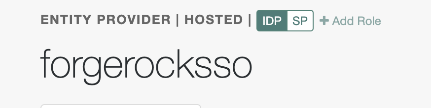

# ServiceNowSSO
## Introduction
External SSO allows organizations to use ForgeRock as an IdP to manage authentication as well as retain basic authentication.
The ForgeRock/ServiceNow SAML 2.0 integration currently supports the following features:  
-IdP-initiated SSO  
-SP-initiated SSO 

## Prerequisites
1.) Login to ServiceNow as the System Administrator   
2.) In the Filter Navigator search for `Plugins`   
3.) Search for `com.snc.integration.sso.multi` on the plugins page   
4.) Install the "Multiple Provider Single Sign-On" and the "Multiple Provider Single Sign-On Enhanced UI"   

## Create IdP application on ForgeRock
First, Create a Circle of Trust: 
1.) In the AM console go to `Realms` > `Realm Name` > `Applications` > `Federation` > `Circles of Trust` > Add Circle of Trust.  
2.) Create a Name(i.e."forgerocksso") for the Circle of Trust > Create 
3.) `Entity Properties` > select at least one IDP and one SP 

 
Next, Create a Hosted Entity Provider: 
`Applications` > `Federation` > `Entity Provider`> Add Entity Provider> Select "Hosted" from drop down 
4.) Enter an Entity ID 
5.) Verify the Entity Provider Base URL value is correct. 
6.) `Meta Aliases`> create a URL-friendly value in the Identity Provider Meta Alias and the Service Provider Meta Alias properties> Create 

 
For more detailed steps visit: https://backstage.forgerock.com/docs/am/7.1/saml2-guide/saml2-providers-and-cots.html   

## Configure ServiceNow using ForgeRock Metadata
1.) Login to ServiceNow as the System Administrator  
2.) Search for `Multi-Provider SSO` > Select `Identity Providers`  
3.) `SSO` > `SAML` 
4.) Import Identity Provider Metadata(This is the XML generated in Access Management via: https://backstage.forgerock.com/knowledge/kb/article/a92228549) 
5.) The SAML settings will auto-populate in a new page 
6.) Under the "User Provisioning" tab select `Auto Provisioning User` and `Update User Record Upon Each Login` 
7.) Test Connection > check Active to Activate the Identity Provider  

 
For more detailed steps visit: https://docs.servicenow.com/bundle/rome-platform-administration/page/integrate/single-sign-on/task/t_CreateUpdateIdentityProvider.html  

## Create SP application on ForgeRock 
1.) In the AM console go to `Realms` > `Realm Name` > `Applications` > `Federation` > `Entity Providers`> Add Entity Providers> Select "Remote" in the drop down 
2.) In order to generate the service provider metadata so back into the ServiceNow console as the System Adminstrator 
3.) Search for Identity Providers > click on the IdP previously created 
4.) Click Generate Metadata  

 
5.) Copy the Metadata and save as XML  
6.) Go back to ForgeRockAM New Remote Entity provider and drag the XML into the Import files section.  
7.) Select the previously created the Circle of Trust from drop down > Create 

 

## SP-Initiated SAML
1.) Configure Multi-Provider SSO properties in the ServiceNow console `Multi-Provider SSO` > `Administration` > `Properties` 
2.) Check `Enable Multi-Provider SSO` 
3.) In the property, The field on the user table that identifies a user accessing the User identification login page, enter the field on the User table that contains the value the IdP uses to identify the user. The default value is user_name. This can be changed depending on use-case.  

 
4.) Append /login_with_sso.do?glide_sso_id=<sys_id of the sso configuration> to the end of the ServiceNow Platform URL  
5.) To find the sys_id go to the ForgeRock IdP set up in the NowPlatform and double click `Identity Provider` select copy URL from the drop down. Then copy the `sys_id` portion of the URL.  

 
6.) Paste the sys_id into the spot that says <sys_id of the sso configuration> of the new URL created in Step 1  
7.) To test, open up an Incognito window and paste in this new URL 

For more detailed steps visit: https://docs.servicenow.com/bundle/rome-platform-administration/page/integrate/single-sign-on/task/t_SettingUpMultiProviderSSO.html 